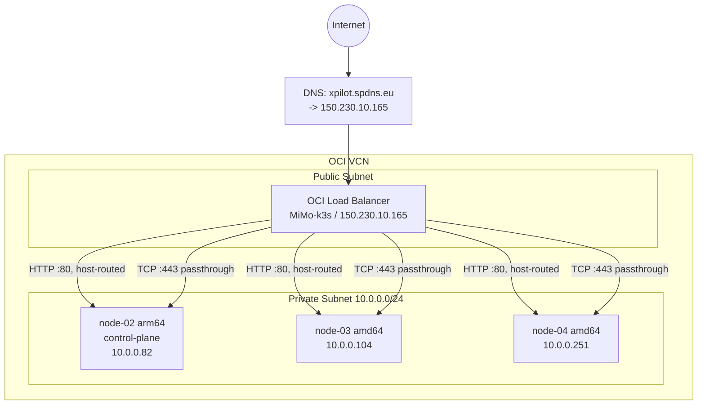
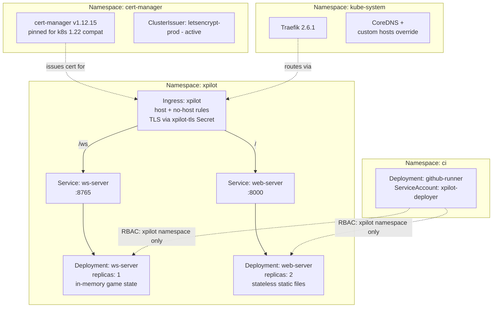
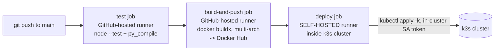

# xpilot-webnet: Solution Architecture

This describes the deployed system as it actually runs today: a Kubernetes
(k3s) application on Oracle Cloud Infrastructure (OCI), fronted by an
existing shared OCI Load Balancer, with automated TLS and CI/CD.

## 1. High-level overview

Traffic terminates TLS at **Traefik** (inside the cluster), not at the LB
-- the LB does plain TCP passthrough on 443, so the certificate (issued by
`cert-manager`) never needs to leave the cluster.

## 2. OCI infrastructure specifics

### 2.1 Load Balancer -- shared, multi-tenant

The `MiMo-k3s` LB (`150.230.10.165`) predates this project and already
served other traffic (a plain `nginx` pod, via `listener_lb_2022-0317-1807`
-> `bs_lb_2022-0317-1807` on port 80). Rather than repoint or duplicate the
LB, xpilot shares it:

| Listener | Port | Protocol | Backend set | Notes |
|---|---|---|---|---|
| `listener_lb_2022-0317-1807` | 80 | HTTP | `bs_lb_2022-0317-1807` | pre-existing, untouched (nginx) |
| *(same listener)* | 80 | HTTP | `bs_xpilot_traefik` | via routing policy `xpilot_host_routing`, matches `Host: xpilot.spdns.eu` |
| `listener_xpilot` | 8888 | HTTP | `bs_xpilot_traefik` | original direct-IP access path, kept as fallback |
| `listener_xpilot_tls` | 443 | TCP (passthrough) | `bs_xpilot_traefik_tls` | real HTTPS traffic; TLS terminates at Traefik |

Backend sets target Traefik directly on each node's private IP -- reached
via k3s's built-in `svclb-traefik` DaemonSet, which forwards each node's
hostPort to Traefik's ClusterIP Service.

**Health checks are HTTP, not TCP**, hitting the app's own `/status`
endpoint. A plain TCP check only proves *something* is listening; it
doesn't prove a request actually reaches a working backend pod, which was
the actual failure mode hit during setup (two of three nodes couldn't
route to pods on other nodes -- see 2.3).

### 2.2 Security Lists -- least-privilege, incrementally opened

The public subnet's security list started locked to one specific
home/office IP for nearly everything. Getting xpilot working publicly
required opening two rules to `0.0.0.0/0` -- unavoidable, since both
general public access and Let's Encrypt's HTTP-01 validation (arbitrary
IPs worldwide, by design) need it.

**Operational rule established during this project**: OCI's
`security-list update` API call *replaces the entire rule set*. Every
change was made by reading the complete current list, appending in code,
and writing the complete list back -- never a partial rule set, since the
same list also holds SSH access rules that would otherwise be destroyed.

### 2.3 Root-caused cluster networking fault (fixed, not a workaround)

Two of the three k3s nodes were unable to route pod traffic to/from the
third -- confirmed via direct pod-IP `curl` tests, and consistent with
`svclb-traefik` showing 70,000+ historical restarts on those two nodes,
going back years.

Isolated by ruling out `iptables` chains (identical across nodes) and
flannel's VXLAN MTU (identical, 8950 everywhere). That left the OCI
security list: **UDP port 8472 -- the port flannel's VXLAN backend uses to
encapsulate all cross-node pod traffic -- had no ingress rule at all.**
One rule fixed years-old cluster instability, not just this deployment.

## 3. Kubernetes architecture

Deliberate design choices:

- **`ws-server` is single-replica.** It holds all connected players in an
  in-memory dict -- two replicas would silently split players into
  separate games. `Recreate` (not `RollingUpdate`) strategy avoids a
  window where two relays are briefly live at once.
- **`web-server` is 2-replica.** Stateless static file serving -- safe to
  scale.
- **CI runner RBAC is scoped to `xpilot` only** (`Role`+`RoleBinding`, not
  `ClusterRole`), even on a shared cluster with other unrelated workloads.
- **`cert-manager` pinned to v1.12.15** -- this cluster's Kubernetes
  (v1.22.7, from 2021) doesn't support a CRD field newer releases require.
- **CoreDNS override** (`k8s/cluster-infra/coredns-custom.yaml`) makes
  `xpilot.spdns.eu` resolve to Traefik's ClusterIP from inside the cluster
  only -- fixes "hairpin NAT" for cert-manager's HTTP-01 self-check.
  External DNS resolution is unaffected.

## 4. Container image

Single multi-arch (`linux/amd64` + `linux/arm64`) image, built via
`docker buildx`, reused for both server processes via a different `args:`
override per Deployment. Multi-arch is not optional -- the cluster's 3
nodes are mixed architecture (`node-02` is arm64, the other two amd64;
OCI's Always Free tier includes Ampere A1/ARM compute). `imagePullPolicy:
Always` is set deliberately, since the image uses a mutable tag -- without
it, a node that already pulled an older image under the same tag would
keep using its stale local copy indefinitely.

## 5. CI/CD

Only `deploy` needs to reach the k3s API server, so only that job runs on
the in-cluster self-hosted runner (`k8s/ci-runner/`), authenticating via
its pod's auto-mounted, narrowly-scoped ServiceAccount token. **The k3s
API server is never exposed to the internet**, and no kubeconfig is ever
stored as a GitHub secret.

## 6. Known limitations

- `ws-server` cannot horizontally scale without adding shared state.
- `node-02` alone runs Traefik (no HA on the ingress controller).
- Docker Hub `:manual` is a manually-managed floating tag today; CI
  already tags with immutable git SHAs once the runner is fully wired up.
- No autoscaling, no persistent storage.

See `ROADMAP.md` for feature-level next steps and `RUNBOOK.md` for the
exact command sequence behind every piece of this document.
